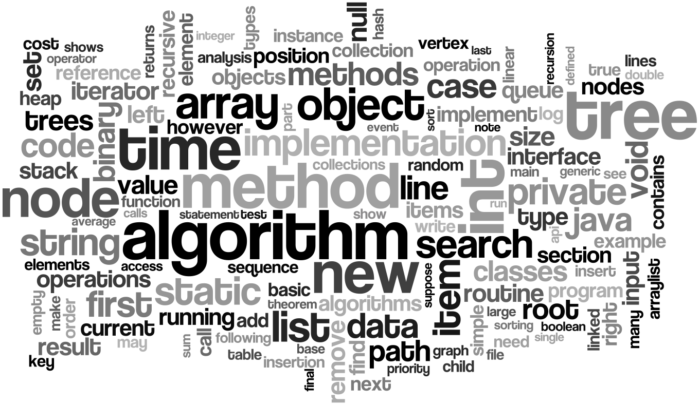

<h1 align="center">
	
	 
	 
</h1>

<h1 align="center">
   
      Data_Structure_n_Algorithms!
   
</h1>

------

* Programming Problems Based On Data_Structure and Algorithms consisting of basic to intermediate level problems

* PRs are welcome. To begin developing, follow the structure:

   > Data_Structure_or_Algorithm_name/file_name.extension
   e.g
   > Linked_List/Cycle_Detection.c

------

# Contribution Guidelines!

Please ensure your `pull request` follow to the below guidelines:
- Contributions are always welcome. Language doesn't matter. Just make sure you're implementing an algorithm..
- Please be sure that program is compiling without an Error or warning before doing Pull Request..
- Please Include Comments in the code about your changes you done there..
- Feel free to suggest any improvements to be done here in Issues..
 
Appreciate your contributions and Thank You in Advance

> Hope you will enjoy working on this repo, it will be great fun for beginners of Data Structure!

----

<b>
Data_Structure_n_Algorithms! is licensed under the MIT License
</b>

<b>Copyright (c) 2018 Archit</b>

